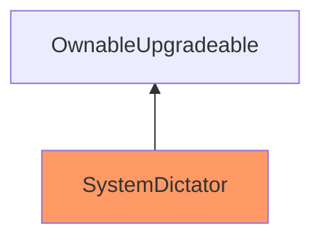
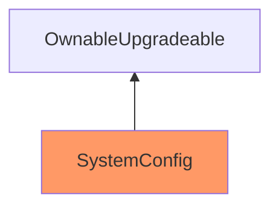

weeeh_

medium

# Corruptible Upgradability Pattern

## Summary
Storage of `SystemDictator` and `SystemConfig` might be corrupted during upgrading, thus causing wrong configuration of an Optimism network.

## Vulnerability Detail

As described by openzeppelin, (https://docs.openzeppelin.com/contracts/4.x/upgradeable#storage_gaps), an empty reserved space in storage should be used in Upgradeable contracts as it allows us to freely add new state variables in the future without compromising the storage compatibility with existing deployments. Furthermore, the contract OwnableUpgradeable.sol, (https://github.com/OpenZeppelin/openzeppelin-contracts-upgradeable/blob/master/contracts/access/OwnableUpgradeable.sol), does declare the "__gap" storage variable, and so should do the inheriting classes.

 As PoC the following inheritance diagrams are given. Note: The contracts highlighted in Orange mean that there are no gap slots defined. 

**Inheritance of the  SystemDictator contract**


<br>

**Inheritance of the SystemConfig contract**



## Impact
Storage of `SystemDictator` and `SystemConfig` might be corrupted during upgrading, thus causing wrong configuration of an Optimism network.


## Code Snippet
https://github.com/sherlock-audit/2023-03-optimism/blob/main/optimism/packages/contracts-bedrock/contracts/deployment/SystemDictator.sol#L28

https://github.com/sherlock-audit/2023-03-optimism/blob/main/optimism/packages/contracts-bedrock/contracts/L1/SystemConfig.sol#L16

## Tool used
https://github.com/tin-z/smart_contract_auditor_tool

## Recommendation
Consider defining an appropriate storage gap in each upgradeable parent contract at the end of all the storage variable definitions as follows:

```solidity
uint256[50] __gap; // gap to reserve storage in the contract for future variable additions
```